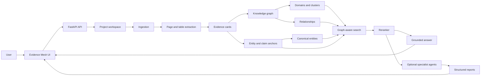

# Evidence Mesh

Evidence Mesh is a graph-aware Retrieval-Augmented Generation (RAG) application
for project documents. It ingests PDFs, spreadsheets, text, and image-based
source material, builds page-level evidence cards, organizes them into a
knowledge graph, and answers questions with cited source evidence.

The public, share-ready application lives in:

```text
core_rag_app/
```

## Why This Exists

Most RAG demos retrieve flat chunks. Real project-document work needs more:

- exact answers with document and page citations
- cross-document evidence
- graph traversal over related requirements, clauses, tables, and domains
- visible search traces
- evaluation reports that diagnose retrieval failures

Evidence Mesh is built as an auditable evidence workbench rather than a black
box chatbot.

## Core Features

- Project creation and document upload
- PDF page rendering and spreadsheet ingestion
- Evidence-card indexing
- Entity and claim extraction
- Canonical entity aliasing
- Domain, cluster, and relationship graph construction
- Graph-aware hybrid retrieval
- Adaptive query modes for exact lookup, multi-hop search, comparison,
  contradiction checks, gap analysis, risk analysis, summaries, and follow-ups
- LLM reranking
- Grounded chat with source citations
- Retrieval evaluation sets with failure diagnosis
- Professional v2 UI for corpus intake, retrieval, graph inspection, quality,
  and runtime settings

## Optional Specialist Agents

The reusable core app is in `core_rag_app/`. The repository also contains the
original tender/project specialist agents at the repository root. These agents
consume the same indexed evidence, search results, and project graph to produce
structured reports:

- Project Background
- Key Information
- Bid Process Evaluation
- Legal Assessment
- Commercial Strategy
- Financial Bonds
- Financial Liabilities and Penalties
- Pre-Bid Queries
- Pre-Qualification Requirements
- Risk Register
- Discrepancy Register

They are shown as an optional layer in the architecture because they are
domain-specific workflows built on top of the retrieval core, not required for
the generic Evidence Mesh application.

## Architecture



More detail is available in
[core_rag_app/docs/architecture.md](core_rag_app/docs/architecture.md).

## Research Paper

The end-to-end research write-up is available at:

[core_rag_app/docs/research_paper.md](core_rag_app/docs/research_paper.md)

Headline test-folder results reported for the current system:

- 98.0% evidence recall

These metrics are benchmark-specific and should not be read as universal
state-of-the-art claims. The paper also includes inspected diagnostic eval
reports and remaining limitations.

## Quick Start

Use Python 3.12 or newer.

```powershell
git clone https://github.com/<your-org>/knowledge_rag.git
cd knowledge_rag\core_rag_app
python -m venv .venv
.\.venv\Scripts\Activate.ps1
python -m pip install --upgrade pip
python -m pip install -r requirements.txt
```

Create a local `.env` file:

```powershell
Copy-Item .env.example .env
```

Then add your provider key and model settings:

```env
LLM_PROVIDER=openrouter
LLM_API_KEY=
LLM_MODEL=google/gemini-3.1-flash-lite
LLM_MAP_MODEL=deepseek/deepseek-v4-flash
LLM_SEARCH_MODEL=deepseek/deepseek-v4-flash

OPENROUTER_API_KEY=your_openrouter_key_here
OPENAI_API_KEY=your_openai_key_here
```

Run the app:

```powershell
python -m uvicorn app:app --host 127.0.0.1 --port 8021
```

Open:

```text
http://127.0.0.1:8021/v2
```

## Basic Workflow

1. Create a project.
2. Upload PDFs, spreadsheets, text files, or images.
3. Build the index and knowledge graph.
4. Ask questions in Retrieval chat.
5. Inspect retrieved sources, graph trace, and top evidence.
6. Run evaluation sets after changing retrieval logic.

## CLI Workflow

From `core_rag_app/`:

```powershell
python ingest.py add C:\path\to\documents
python indexer.py --build-embeddings --build-entity-claims
python entity_canonicalizer.py build
python knowledge_graph.py --build-summaries
python searcher.py "Who pays for construction power?" --max-hits 12
python evaluator.py eval_sets/example_retrieval_eval.json --max-hits 12
```

## Privacy and Data Safety

The repository is configured so private runtime data is not committed:

- `.env`
- uploaded documents
- project indexes
- generated search results
- cache files
- logs
- PDFs, spreadsheets, CSVs, and zip exports

Only source code, docs, config templates, and small evaluation fixtures should
be public.

## Verification

```powershell
cd core_rag_app
python -m py_compile app.py ingest.py indexer.py embeddings.py entity_claims.py entity_canonicalizer.py community_summaries.py query_modes.py reranker.py knowledge_graph.py searcher.py evaluator.py
```

## License

MIT License. See [LICENSE](LICENSE).

## Disclaimer

Evidence Mesh is a research and developer tool for document retrieval and
analysis. Do not use generated answers as legal, financial, engineering, or
contractual advice without expert human review.
