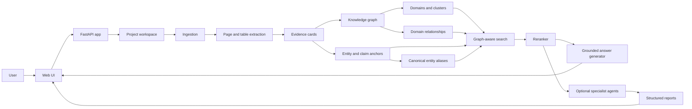
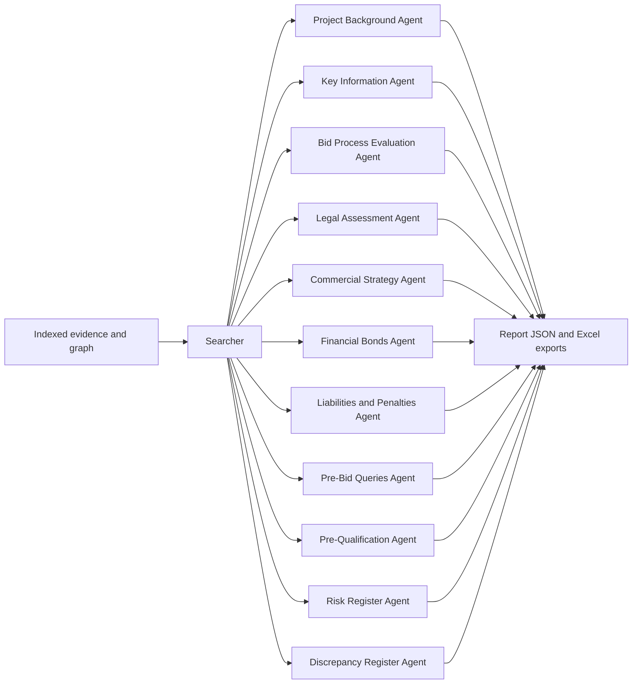
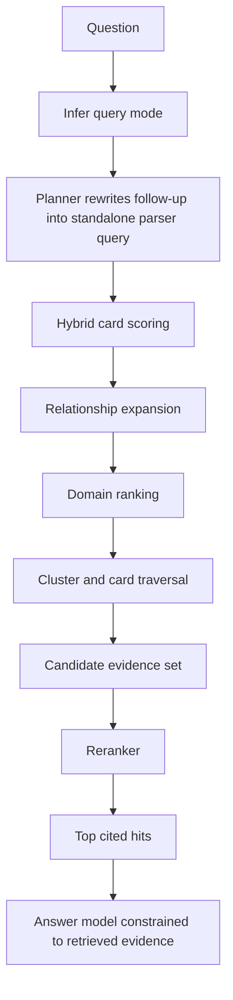
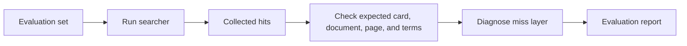

# Evidence Mesh Architecture

Evidence Mesh is organized as a project-scoped document ingestion, indexing,
graph construction, retrieval, and answer-generation system.

## High-Level Flow

## Runtime Components

| Component | Main files | Purpose |
|---|---|---|
| API and UI server | `app.py` | Projects, uploads, build pipeline, chat, settings, static UI |
| Ingestion | `ingest.py` | Adds uploaded files to the project inventory |
| Evidence indexing | `indexer.py` | Converts pages and spreadsheet chunks into evidence cards |
| Embeddings | `embeddings.py` | Builds semantic sidecar scores for hybrid retrieval |
| Entity and claims | `entity_claims.py` | Extracts typed entities and atomic claims from cards |
| Canonicalization | `entity_canonicalizer.py` | Groups entity aliases and maps cards to canonical entities |
| Community summaries | `community_summaries.py` | Builds domain/community summaries for global retrieval |
| Knowledge graph | `knowledge_graph.py` | Builds clusters, domains, and relationships |
| Query modes | `query_modes.py` | Classifies user intent into retrieval modes |
| Search | `searcher.py` | Performs hybrid graph-aware retrieval and writes search runs |
| Reranking | `reranker.py` | Reranks candidate evidence hits |
| Evaluation | `evaluator.py` | Runs benchmark cases and diagnoses misses |
| Storage | `storage.py`, `postgres_schema.sql` | JSON compatibility and PostgreSQL persistence |

## Optional Specialist Agent Layer

The generic shareable core is `core_rag_app/`. The original full repository
also includes a tender/project report-agent layer at the repository root. These
agents are not required for the core Evidence Mesh app, but they are part of
the broader system when running the original project workflow.

| Agent | File | Output |
|---|---|---|
| Project Background | `project_background.py` | project background report |
| Key Information | `key_information.py` | key facts and reference details |
| Bid Process Evaluation | `bid_process_evaluation.py` | bid-process compliance review |
| Legal Assessment | `legal_assessment.py` | legal and contractual risk review |
| Commercial Strategy | `commercial_strategy.py` | commercial drivers and strategy |
| Financial Bonds | `financial_bonds.py` | bonds and guarantees summary |
| Financial Liabilities and Penalties | `financial_liabilities_penalties.py` | liabilities, penalties, and exposure |
| Pre-Bid Queries | `prebid_queries.py` | clarification questions with sources |
| Pre-Qualification Requirements | `prequalification_requirements.py` | prequalification matrix |
| Risk Register | `risk_register.py` | risk register |
| Discrepancy Register | `discrepancy_report.py` | discrepancy register |

The agents should be described as application-specific workflows that sit on
top of the retrieval substrate. This keeps the public architecture honest:
Evidence Mesh is the generic evidence engine; the report agents are a
specialized downstream product layer.

## Retrieval Pipeline

## Hybrid Scoring Signals

Evidence Mesh combines:

- semantic embedding similarity
- lexical keyword score
- typed entity/claim score
- canonical entity score
- relationship signal
- graph traversal score
- community-summary boost
- final LLM reranking

The weights change by query mode. Exact lookup emphasizes lexical and
entity/claim evidence. Global, comparison, contradiction, gap, and risk modes
use stronger graph and relationship signals.

## Evaluation Loop

Failure diagnosis is designed to identify where retrieval broke:

- expected document never entered the search path
- no matching domain visited
- domain visited but cluster missed
- cluster visited but card missed
- card retrieved but page mismatch

## Storage Boundary

Source code, docs, templates, and small eval fixtures are safe to share.
Runtime data is not.

Ignored runtime data includes:

- `.env`
- `projects/`
- uploaded documents
- indexes
- search results
- eval reports from private corpora
- logs
- caches
- PDFs, spreadsheets, CSVs, and zip exports

## Public Release Notes

When hosting or sharing a demo:

- use synthetic or public documents only
- keep API keys server-side
- rate-limit chat and upload endpoints
- disable persistent public uploads unless access-controlled
- show benchmark context next to any accuracy claim
- include human-review disclaimers for high-stakes domains
