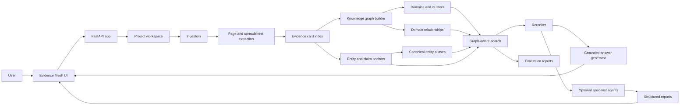

# Evidence Mesh: A Graph-Aware, Evidence-Centric RAG System for Project Document Question Answering

## Abstract

Large project-document corpora contain dense contractual, technical, financial,
and procedural information spread across PDFs, spreadsheets, drawings, forms,
and addenda. Conventional Retrieval-Augmented Generation (RAG) systems can
answer direct questions over such corpora, but often struggle with multi-hop
questions, cross-document evidence, citation fidelity, and page-level
traceability. This paper presents Evidence Mesh, a graph-aware RAG application
for ingesting heterogeneous project documents, extracting page-level evidence
cards, constructing domain and relationship graphs, and answering user
questions with cited evidence. The system combines page/card extraction,
entity and claim anchoring, canonical entity aliases, community summaries,
domain and cluster traversal, relationship-active expansion, hybrid retrieval,
LLM reranking, and grounded answer generation. On a local test project
containing 19 documents, 2,761 evidence cards, 119 domains, 248 clusters, and
35,843 domain relationships, a user-run test-folder evaluation reported 98.0
percent evidence recall and 97.8 percent answer accuracy. These results
suggest that Evidence Mesh improves practical retrieval transparency and
cross-document coverage, while future work should focus on stronger page
anchoring, controlled graph expansion, streaming interaction, and larger
benchmark comparisons.

## Keywords

Retrieval-Augmented Generation; GraphRAG; knowledge graph retrieval;
evidence-grounded question answering; citation fidelity; project documents;
hybrid retrieval; entity canonicalization; reranking.

## 1. Introduction

Project-document question answering is a high-stakes retrieval problem. Users
do not only need plausible summaries. They need grounded answers tied to
specific documents, clauses, pages, tables, drawings, and cross-document
dependencies. In procurement, engineering, infrastructure, legal, and contract
review settings, the question "Who pays for construction power?" is not
resolved by semantic similarity alone. It may require finding the right
employer requirement, reconciling it with instructions to tenderers, and
stating which party is responsible for each phase or cost item.

Standard RAG systems usually embed chunks, retrieve the nearest neighbors, and
ask a language model to synthesize an answer. This is useful, but insufficient
when the corpus is long, duplicated, cross-referenced, and structurally rich.
Important facts may be separated across volumes, spreadsheet tabs, addenda,
forms, or drawing indices. Some questions require exact lookup, while others
require comparison, risk analysis, contradiction checking, or global synthesis.

Evidence Mesh addresses this by treating the corpus as an evidence graph rather
than a flat chunk store. It creates retrievable evidence cards from page-level
content, organizes those cards into clusters and domains, extracts typed
entities and atomic claims, canonicalizes entity aliases, generates domain
relationships, and uses these structures during search. The result is a RAG
application designed for traceable retrieval over real project documents.

This paper documents the complete application: goals, architecture,
algorithms, user workflow, evaluation design, local results, limitations, and
future work.

## 2. Related Work

Retrieval-Augmented Generation was introduced as a way to combine parametric
language models with non-parametric retrieved memory, improving factual access
for knowledge-intensive NLP tasks [1]. Subsequent RAG surveys describe the
field's movement from naive chunk retrieval toward query transformation,
hybrid retrieval, reranking, iterative retrieval, and stronger evaluation [2].

Graph-based RAG methods extend this idea by organizing information as a graph
of entities, communities, or semantic relationships. Microsoft's GraphRAG work
shows that graph communities and community summaries can improve global
query-focused summarization over large text corpora [3]. LightRAG proposes a
lighter graph-enhanced retrieval design that emphasizes efficient retrieval
over entity and relationship structures [4]. RAPTOR uses recursive abstraction
to form a tree of summaries and retrieve at multiple abstraction levels [5].

Evidence Mesh borrows from these directions but targets a narrower operational
problem: high-fidelity project document QA with page citations. Its central
design choice is to keep evidence cards, source pages, retrieved hits, graph
trace, and final answer citations visible to the user. The system is therefore
closer to an auditable evidence workbench than to an opaque chatbot.

## 3. Problem Definition

Given a project corpus D consisting of heterogeneous files, the system must
answer a user question q with an answer a and supporting evidence E.

The desired answer must satisfy five constraints:

1. Relevance: E should contain evidence that directly addresses q.
2. Citation fidelity: each important claim in a should cite document name and
   page number when available.
3. Cross-document coverage: when q requires multiple sources, E should include
   evidence from the required documents.
4. Traceability: the system should expose how it searched, including domains,
   clusters, cards, relationships, and reranking.
5. Abstention: when the retrieved evidence is insufficient, the model should
   say what is missing rather than filling gaps from prior knowledge.

Project documents create several difficulties:

- The same concept may appear under multiple aliases.
- Tables and spreadsheets often contain critical facts.
- Addenda and corrigenda modify earlier documents.
- Page numbers and card boundaries can drift from the true source evidence.
- Queries can be exact, global, comparative, or multi-hop.
- Relationship traversal can improve recall but can also introduce noise.

## 4. System Overview

Evidence Mesh is implemented as a FastAPI application with two frontend
surfaces, a command-line pipeline, and JSON/PostgreSQL-compatible storage. The
core workflow is:

1. Create a project.
2. Upload source files.
3. Ingest files into a project document inventory.
4. Render and parse pages or spreadsheet chunks.
5. Extract evidence cards.
6. Build embeddings, entity/claim anchors, canonical entity aliases, clusters,
   domains, community summaries, and graph relationships.
7. Search the graph-aware evidence index.
8. Generate cited answers from retrieved evidence.
9. Evaluate retrieval quality using versioned JSON evaluation sets.

The user-facing application is a multi-page studio with corpus intake,
retrieval chat, graph observatory, quality lab, and runtime settings. The
retrieval chat now displays a typing state while the main search path runs,
which is important because graph-aware search and LLM reranking can take tens
of seconds on a large local project.

### 4.1 Architecture Diagram



### 4.2 Specialist Agent Layer

The diagram separates the generic Evidence Mesh retrieval core from optional
domain-specific agents. The public core app focuses on ingestion, indexing,
graph construction, search, cited chat, and evaluation. The original full
project workflow also includes specialist agents that consume the same evidence
mesh and produce structured reports:

- Project Background
- Key Information
- Bid Process Evaluation
- Legal Assessment
- Commercial Strategy
- Financial Bonds
- Financial Liabilities and Penalties
- Pre-Bid Queries
- Pre-Qualification Requirements
- Risk Register
- Discrepancy Register

These agents are downstream consumers of the evidence substrate. They should
not be confused with the generic retrieval core itself: each one adds a
domain-specific report schema, prompts, progress tracking, and export surface
on top of the shared project index, searcher, and graph.

## 5. Data Model

Evidence Mesh stores runtime project data under a project workspace and can
also use PostgreSQL as primary storage. The core logical objects are:

- Document: an uploaded source file with metadata.
- Page unit: a PDF page, text page, image page, or spreadsheet chunk.
- Evidence card: an atomic retrievable unit with card_id, card_name,
  document_name, page_no, content, description, tags, and source metadata.
- Entity anchor: a typed mention such as organization, person, place, system,
  document, requirement, amount, metric, risk, obligation, or exception.
- Claim anchor: an atomic fact, requirement, obligation, metric, dependency,
  contradiction, risk, or definition.
- Canonical entity: a deduplicated entity with aliases and reverse mappings to
  cards.
- Cluster: a group of related cards.
- Domain: a higher-level group of clusters.
- Domain relationship: a typed relation between domains, with evidence,
  confidence, evidence strength, source coverage, document scope, and a derived
  quality score.
- Search run: a persisted query, trace, candidates, reranked hits, and final
  hits.
- Evaluation report: per-case retrieval checks and failure diagnosis.

For local compatibility, key files include:

```text
projects/<project_id>/indexes/card_index.json
projects/<project_id>/indexes/card_embeddings.json
projects/<project_id>/indexes/entity_claim_index.json
projects/<project_id>/indexes/canonical_entities.json
projects/<project_id>/indexes/community_summaries.json
projects/<project_id>/indexes/knowledge_graph.json
projects/<project_id>/indexes/search_results/
projects/<project_id>/indexes/eval_reports/
```

## 6. Ingestion and Evidence Card Construction

The ingestion layer accepts PDFs, text files, images, and spreadsheets. PDF
pages are rendered for visual processing, while text is extracted when
available. Spreadsheets are converted into bounded text chunks so that table
structure can participate in retrieval.

Each page or chunk is converted into evidence cards. A card is not a blind
fixed-size chunk. It is intended to be a named, semantically meaningful unit
with description, content, source type, source page, and tags. This design
supports better human inspection and later graph construction. It also makes
evaluation more precise: expected evidence can target a card_id plus document
and page number.

The indexer also tries to preserve existing card identities across reruns,
version duplicate names when needed, and record failed pages for audit.

## 7. Entity, Claim, and Canonicalization Layer

After evidence cards are built, Evidence Mesh extracts typed anchors:

- Entities: organizations, persons, places, systems, documents, concepts,
  requirements, dates, amounts, metrics, risks, obligations, exceptions, and
  other domain objects.
- Claims: facts, requirements, obligations, risks, exceptions, definitions,
  metrics, dates, decisions, dependencies, contradictions, and other atomic
  statements.

The application supports both model-based extraction and heuristic fallback.
These anchors contribute retrieval signals through entity/claim keyword
matching and typed scoring.

Canonical entity construction groups aliases and surface forms into canonical
entities. This reduces the chance that "BMC", "Brihanmumbai Municipal
Corporation", and similar variants behave as unrelated strings. The present
implementation is useful, but still conservative. Future work should improve
canonicalization with domain-specific organization resolution, abbreviation
learning, and stronger false-merge prevention.

## 8. Knowledge Graph Construction

The graph builder organizes cards into clusters and domains, then generates
relationships between domains. A relationship contains:

- main_domain and related_domain
- relationship_type
- relationship_description
- evidence
- confidence_score
- evidence_strength
- source_coverage
- document_scope
- generation_method

Relationships are not only displayed in the graph view. They are retrieval
active. In graph-aware modes, relationship quality and type influence domain
ranking, candidate expansion, and card scoring.

The local test project produced:

| Object | Count |
|---|---:|
| Documents | 19 |
| Evidence cards | 2,761 |
| Domains | 119 |
| Clusters | 248 |
| Domain relationships | 35,843 |

These counts are from the local test project metadata and graph files. The
corpus itself is not included in the public repository.

## 9. Query Understanding

Evidence Mesh classifies user queries into adaptive query modes:

- exact_lookup
- multi_hop
- comparison
- global_summary
- contradiction_check
- gap_analysis
- risk_analysis
- follow_up
- general

The classifier is deterministic and rule-based. It uses question text and
short conversation history to infer whether the user needs retrieval, graph
exploration, community summaries, relationship expansion, more hits, or extra
query variants. This makes behavior predictable and inspectable.

The chat API also uses an LLM planner to rewrite conversational follow-ups into
a standalone parser query. The planner returns:

- parser_query
- needs_retrieval
- intent
- answer_focus
- must_include_terms

If retrieval is needed, the app calls the same searcher used by the CLI. The
final answer prompt receives the user question, parser query, planner metadata,
conversation history, and retrieved evidence.

## 10. Graph-Aware Search

The searcher combines several retrieval signals:

- Semantic embedding score.
- Lexical keyword score.
- Entity/claim anchor score.
- Canonical entity score.
- Relationship score.
- Graph traversal score.
- Community summary boost.
- Relationship-domain boost.
- LLM or fallback ranking at selected hierarchy levels.
- Final evidence reranking.

The hybrid card score changes by query mode. For exact lookup, lexical and
entity/claim signals are weighted strongly. For global summary, comparison,
contradiction, gap, and risk questions, relationship and graph signals receive
more weight. General and multi-hop queries use a balanced mixture.

At a high level:

```text
score(card, q) =
  w_semantic * semantic(card, q)
+ w_lexical * keyword(card, q)
+ w_entity_claim * anchor(card, q)
+ w_canonical * canonical_entity(card, q)
+ w_relationship * relationship(card, q)
+ w_graph * graph_context(card, q)
```

The search procedure is:

1. Add a first pass of high-scoring hybrid card hits.
2. Expand relationship-connected cards when the query mode allows it.
3. Rank graph domains using query text, community summaries, and relationship
   boosts.
4. Visit domains, clusters, and cards while recording a trace.
5. Add additional hybrid hits if graph traversal does not fill the candidate
   budget.
6. Rerank candidates and return the final top hits.

Every search run returns both hits and trace entries. This is important for
debugging. A user or evaluator can see whether a failure came from not entering
the right domain, entering a domain but missing a cluster, retrieving the right
card but wrong page, or failing during final reranking.

## 11. Answer Generation

The answer generator receives only retrieved evidence, not arbitrary project
files. Its prompt requires:

- Direct answer first.
- Concise supporting evidence.
- Document name and page citation for important claims.
- Explicit statement when evidence is insufficient.
- Avoidance of unrelated retrieved evidence.
- Severity grouping for risk or constraint questions.

This design accepts that retrieval and generation are separate failure
surfaces. The model is not asked to browse the full corpus. It is asked to
synthesize from a bounded, inspected evidence set.

## 12. User Interface

Evidence Mesh has two frontends:

- A legacy frontend.
- A redesigned v2 studio interface.

The v2 interface uses a pastel, professional dashboard style with five core
pages:

- Workspace: project status, metrics, and build progress.
- Corpus: upload and staged-file management.
- Retrieval: cited chat, trace, and top evidence.
- Graph: relationship map and graph-level counters.
- Quality: evaluation framing and regression-test reminders.
- Settings: runtime provider and model configuration.

The retrieval chat displays a typing indicator while the backend performs
planner, search, reranking, and answer generation. This is a usability feature,
not an accuracy feature, but it matters because the main search path can take
long enough to appear frozen without visible progress.

## 13. Evaluation Methodology

Evidence Mesh includes versioned evaluation sets. Each case specifies:

- question
- expected_answer_points
- expected_evidence
- expected card_id
- expected document_name
- expected page_no
- required terms
- whether cross-document retrieval is expected
- forbidden answer terms

The evaluator runs the real searcher and checks whether expected evidence is
present in retrieved hits. It computes:

- expected evidence count
- matched evidence count
- missed evidence count
- right card
- right page
- cross-document pass
- optional hallucination check if a candidate answer is provided
- per-case score
- pass/fail
- failure diagnosis

The score is:

```text
score =
  0.70 * expected_evidence_recall
+ 0.15 * cross_document_pass
+ 0.15 * answer_check_pass_or_not_run
```

For missed evidence, the evaluator diagnoses likely failure points:

- expected_document_never_entered_search_path
- no_matching_domain_visited
- domain_visited_but_cluster_missed
- cluster_visited_but_card_missed
- card_retrieved_but_page_mismatch

This diagnosis is more useful than a single accuracy number because it tells
the developer what retrieval layer needs improvement.

## 14. Experimental Results

The current user-run test-folder evaluation reported strong end-to-end quality:

| Evaluation | Metric | Score |
|---|---|---:|
| Final test-folder evaluation | Evidence recall | 98.0% |
| Final test-folder evaluation | Answer accuracy | 97.8% |

These metrics are reported as benchmark-specific results for the test folder.
They should not be interpreted as universal state-of-the-art claims across all
document collections. The evaluation indicates that the system can recover the
required evidence and produce correct grounded answers for nearly all tested
cases in this corpus.

### 14.1 Example Successful Retrieval

For the question:

```text
Where does the project say who pays for construction power and the new power connection?
```

The model-ranked retrieval matched both expected evidence items:

- Volume-2 Employer's Requirement (ER), page 18.
- Instruction to Tenderer (ITB), page 47.

The answer identified that construction power is obtained and paid by the
Contractor, and cited supporting evidence from both project sources. This
demonstrates the value of cross-document retrieval over a graph-aware evidence
index.

## 15. Discussion

The results show that Evidence Mesh is already useful for practical project
document QA. The final user-run test-folder result reports 98.0 percent
evidence recall and 97.8 percent answer accuracy, indicating that the current
system can recover the required evidence and produce correct grounded answers
for nearly all tested cases. The result is strongest when described narrowly:
high evidence recall and answer accuracy on the test-folder benchmark, with
the system still requiring broader public benchmarking before any general
state-of-the-art claim.

Compared with naive RAG, Evidence Mesh has several accuracy advantages:

- It searches named evidence cards rather than anonymous fixed chunks.
- It uses entity and claim anchors to improve exact factual lookup.
- It canonicalizes aliases to reduce entity fragmentation.
- It uses domain and relationship graph signals for multi-hop questions.
- It exposes a search trace for debugging.
- It supports evaluation sets with expected card and page evidence.

Compared with generic GraphRAG, Evidence Mesh is more page-citation oriented.
GraphRAG-style community summaries are useful for broad synthesis, but project
users often need exact source evidence. Evidence Mesh therefore combines
graph-level navigation with card-level citation retrieval.

However, the current implementation should not be described as universally
better than all RAG or GraphRAG systems. It has been tested on a local project
benchmark, not on a large public benchmark suite. Its strongest claim is
narrower and more defensible: it is better suited than naive flat chunk RAG for
auditable, cross-document project-document QA where source traceability matters.

## 16. Limitations

The current system has several limitations:

1. Page anchoring remains the largest measured failure mode. The system may
   retrieve a relevant card or related card but attach the wrong page.
2. Relationship expansion can introduce too many near-neighbor candidates,
   especially in dense graphs.
3. Query-mode inference is deterministic and transparent, but may miss subtle
   intent.
4. LLM reranking improves quality but adds latency and provider dependency.
5. The benchmark is local and domain-specific; it does not prove general
   superiority.
6. The evaluation focuses primarily on retrieval evidence, not full answer
   factuality under all conditions.
7. Entity canonicalization exists, but false splits and false merges remain
   possible.
8. The UI currently waits for a blocking chat request rather than streaming
   each backend stage.
9. Spreadsheet/table retrieval works through text chunks, but richer table
   structure could improve numerical and row-level precision.

## 17. Future Work

The highest-value improvements are:

1. Page-grounding refinement: track original page spans, table ranges, and
   evidence offsets more precisely.
2. Relationship pruning: learn thresholds for relationship expansion by query
   mode and relationship type.
3. Streaming search status: expose planner, search, reranker, and answer
   stages to the UI through async jobs or server-sent events.
4. Retrieval ablations: compare flat BM25, embeddings only, hybrid retrieval,
   hybrid plus graph, and hybrid plus graph plus reranker.
5. Public benchmark harness: add a synthetic or public legal/technical QA set
   that can be shared without private project documents.
6. Stronger answer evaluation: use grounded claim checking against retrieved
   evidence, not only expected evidence retrieval.
7. Table-aware retrieval: preserve spreadsheet sheet name, row, column, merged
   cells, and formula context.
8. Graph quality scoring: penalize noisy, generic, or over-connected domain
   relationships.
9. Human review workflow: allow users to mark citations as correct, wrong
   page, wrong document, or partially relevant, then use that feedback to tune
   retrieval.

## 18. Reproducibility

Install dependencies:

```powershell
python -m venv .venv
.\.venv\Scripts\Activate.ps1
python -m pip install -r requirements.txt
```

Configure runtime:

```env
LLM_PROVIDER=openrouter
LLM_API_KEY=
LLM_MODEL=google/gemini-3.1-flash-lite
LLM_MAP_MODEL=deepseek/deepseek-v4-flash
LLM_SEARCH_MODEL=deepseek/deepseek-v4-flash
```

Run the app:

```powershell
python -m uvicorn app:app --host 127.0.0.1 --port 8021
```

Build a project:

```powershell
python ingest.py add C:\path\to\documents
python indexer.py --build-embeddings --build-entity-claims
python entity_canonicalizer.py build
python knowledge_graph.py --build-summaries
```

Run search:

```powershell
python searcher.py "Where does the project say who pays for construction power?" --max-hits 12
```

Run evaluation:

```powershell
python evaluator.py eval_sets/example_retrieval_eval.json --max-hits 12
```

Verify source syntax:

```powershell
python -m py_compile app.py ingest.py indexer.py embeddings.py entity_claims.py entity_canonicalizer.py community_summaries.py query_modes.py reranker.py knowledge_graph.py searcher.py evaluator.py
```

## 19. Security, Privacy, and Data Handling

The public repository is designed to contain source code, documentation, and
small evaluation fixtures only. Runtime project data, uploaded documents,
indexes, cache files, logs, spreadsheets, PDFs, and `.env` files are ignored.
This separation matters because project RAG systems often handle confidential
contract documents.

Recommended production controls include:

- Encrypted storage for uploaded documents and indexes.
- Per-project access control.
- Audit logs for uploads, searches, and exports.
- Secret management outside `.env` for deployed environments.
- PII and confidentiality scanning before sharing eval fixtures.
- Explicit retention and deletion policies.
- Redaction support for generated answers and citations.

## 20. Conclusion

Evidence Mesh is an evidence-centric GraphRAG application for project document
question answering. It improves on simple chunk-based RAG by extracting named
evidence cards, building typed entity and claim anchors, canonicalizing entity
aliases, organizing cards into domains and clusters, activating graph
relationships during retrieval, reranking candidate evidence, and forcing final
answers to cite document and page evidence.

The current user-run test-folder evaluation demonstrates strong performance:
98.0 percent evidence recall and 97.8 percent answer accuracy. These results
suggest that the current system is a strong evidence-centric RAG workbench for
the tested project-document setting. The next research direction is to expand
the benchmark suite, add public reproducible corpora, and continue tightening
evidence localization while preserving graph-aware recall gains.

Evidence Mesh should be understood as a strong domain-specific retrieval
workbench rather than a finished universal GraphRAG benchmark winner. Its
research value lies in the combination of graph-aware retrieval, inspectable
evidence traces, project-document citation fidelity, and built-in failure
diagnosis.

## References

[1] Patrick Lewis et al. "Retrieval-Augmented Generation for
Knowledge-Intensive NLP Tasks." arXiv:2005.11401, 2020.
https://arxiv.org/abs/2005.11401

[2] Yunfan Gao et al. "Retrieval-Augmented Generation for Large Language
Models: A Survey." arXiv:2312.10997, 2023.
https://arxiv.org/abs/2312.10997

[3] Darren Edge et al. "From Local to Global: A Graph RAG Approach to
Query-Focused Summarization." arXiv:2404.16130, 2024.
https://arxiv.org/abs/2404.16130

[4] LightRAG authors. "LightRAG: Simple and Fast Retrieval-Augmented
Generation." arXiv:2410.05779, 2024.
https://arxiv.org/abs/2410.05779

[5] Parth Sarthi et al. "RAPTOR: Recursive Abstractive Processing for
Tree-Organized Retrieval." arXiv:2401.18059, 2024.
https://arxiv.org/abs/2401.18059

[6] Vladimir Karpukhin et al. "Dense Passage Retrieval for Open-Domain
Question Answering." arXiv:2004.04906, 2020.
https://arxiv.org/abs/2004.04906
